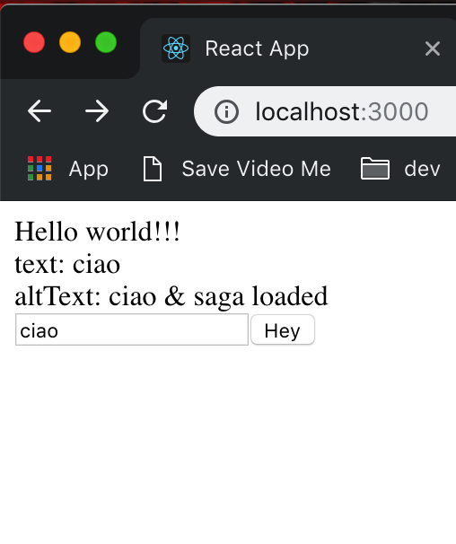
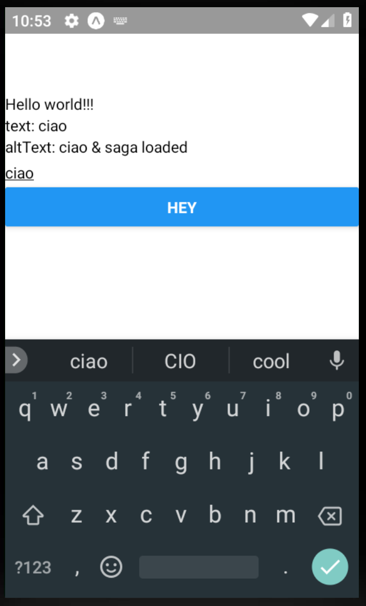
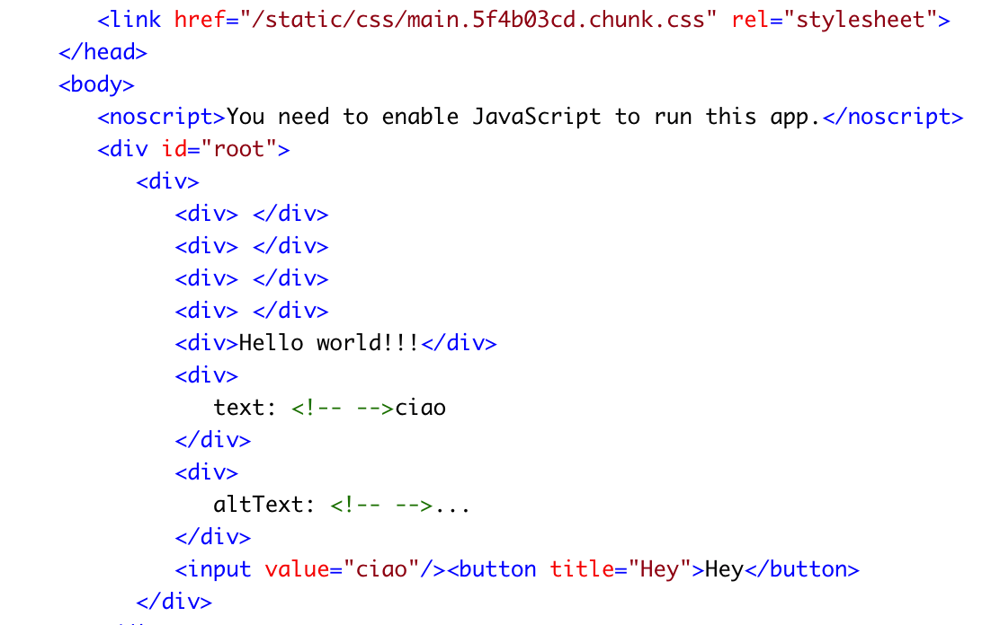

REACT UNIVERSAL
===
*made with Recioto della Valpolicella*

* Browser || Native || Server
* Create React App 2.0 & Expo
* Without **eject**
* Redux (with injector)
* Saga (with injector)
* Reselect
* ImmutableJS
* React Router
* React Frontload


**Browser**



```
yarn start
```

**Native**



```
expo start
```

**Server**



```
yarn build && yarn serve
```