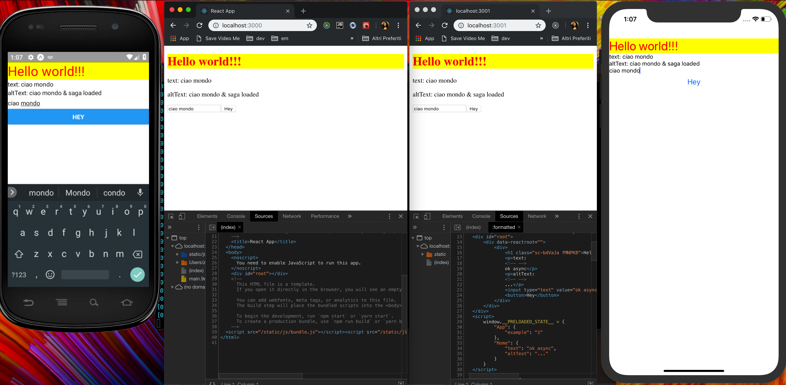

REACT UNIVERSAL
===
*made with Recioto della Valpolicella*

* Browser || Native || Server
* Create React App 2.0 & Expo 1.4 & CRACO
* Without **eject**
* Redux (with injector)
* Saga (with injector)
* Reselect
* ImmutableJS
* React Router with History
* React Frontload for server & client
* SEO friendly with Helmet




**Server**

```
yarn build:all && yarn start:server
```

**Browser**

```
yarn start
```

**Native**

```
yarn e-start
```
