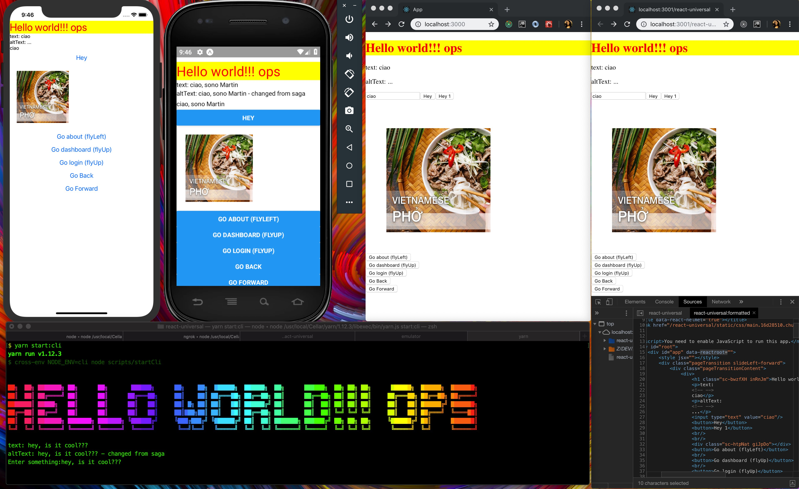

REACT UNIVERSAL
===
*made with Recioto della Valpolicella*

* Browser || Native || Server || Command line
* Create React App 2.0 & Expo 1.4 & Ink
* CRACO without **eject**
* Redux (with injector)
* Saga (with injector)
* Reselect
* ImmutableJS
* React Router with History and **Animation**
* React Frontload for server & client
* SEO friendly with Helmet



[Live demo](https://martinpham.gitlab.io/react-universal/)

[Screencast](https://youtu.be/FGLXWDszOF4)


**Server**

```
yarn server:prod
```

**Browser**

```
yarn browser:dev
```

**Browser (production)**

```
yarn browser:prod
```

**Native**

```
yarn native:start
```

**Command line**

```
yarn cli:dev
```

**Command line (production)**

```
yarn cli:prod
```
